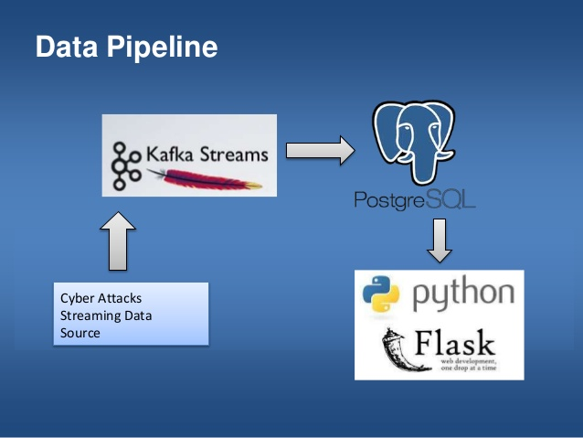

# Cyber-Attack-Analysis
This project provides Real Time Analytics on Cyber Attack Hotspots and Trends across the globe

UI is available at <a href="http://shwetha.site"> CyberAttackAnalysis</a>. 
The presentation is available on <a href= "#" > SlideShare </a>

I have implemented an end to end pipeline using
<ul>
<li> Apache Kafka </li>
<li> Apache Kafka Streams </li>
<li> PostgreSQL </li>
<li> Flask with Highcharts.js </li>
</ul>

## Real Time Analytics and Trend Features:
<ul> 
<li> Hotspot Analysis - <a href = "http://resources.esri.com/help/9.3/arcgisengine/java/gp_toolref/spatial_statistics_tools/how_hot_spot_analysis_colon_getis_ord_gi_star_spatial_statistics_works.htm" > Getis-Ord Gi* (Spatial Statistic) calculation </a>
    
 This score is used to identify spatially significant hotspots for every feature provided. A statistically significant hotspot is a spatial cell with high attack count and is surrounded by cells with large attack count values.

<li> Interactive query - Finding Real Time Cyber Attack Trends in a region 

 A user can select any region on the map and the trends for a radius of 10 Kms around that point is shown. This involved calculating the <a href = "https://en.wikipedia.org/wiki/Minimum_bounding_box" > Bounding Box</a>.</li>
</ul
## Data Pipeline

## Ingestion

 The data for cyber attacks was collected from a streaming source and written to the Kafka Topic. The data was also be genrated (for the purpose of scaling) using the cyber_data_prod.py under kafka_producer folder. 

## Stream Processing

 Kafka Streams client library was used to perform stream processing. It reads the input from the Kafka topics, processes the data and writes to another Kafka Topic. The following tasks were performed on streaming data. 

<ul>
<li> Parsing the input JSON and filtering the content
<li> Aggregating the count of cyber attacks using stateful streaming
<li> Calculating GiScore using Stateful streaming for a time window of 10 seconds
</ul>

