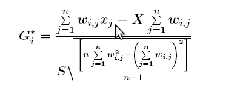

# Cyber-Attack-Analysis
This project provides Real Time Analytics on Cyber Attack Hotspots and Trends across the globe

UI is available at <a href="http://shwetha.site"> CyberAttackAnalysis</a>. 
The presentation is available at <a href= "https://www.slideshare.net/ShwethaNarayanan1/cyber-attacks-spatial-analysis/" > Cyber Attacks Analysis </a>

I have implemented an end to end pipeline using
<ul>
<li> Apache Kafka </li>
<li> Apache Kafka Streams </li>
<li> Postgres </li>
<li> Python Flask with Highcharts.js </li>
</ul>

## Real Time Analytics and Trend Features:
<ul> 
<li> Hotspot Analysis - <a href = "http://resources.esri.com/help/9.3/arcgisengine/java/gp_toolref/spatial_statistics_tools/how_hot_spot_analysis_colon_getis_ord_gi_star_spatial_statistics_works.htm" > Getis-Ord Gi* (Spatial Statistic) calculation </a>
 This score is used to identify spatially significant hotspots for every feature provided. A statistically significant hotspot is a spatial cell with high attack count and is surrounded by cells with large attack count values. </li>

<li> Interactive query - Finding Real Time Cyber Attack Trends in a region 
  A user can select any region on the map and the trends for a radius of 10 Kms around that point is shown. This involved calculating the <a href = "https://en.wikipedia.org/wiki/Minimum_bounding_box" > Bounding Box</a>.</li>
</ul>

## Data Pipeline
 

## Ingestion

 The data for cyber attacks was collected from a streaming source and written to the Kafka Topic. 
This data comprises of the attack type information and the spatial co-ordinates of the affected servers. In this project, I have considered only Backdoor, Malware and DDOS as cyber attacks. 
The data was also artificially generated (for the purpose of scaling) using the cyber_data_prod.py under kafka_producer folder.
On an average, about 100,000 cyber attack events per minute are written to a Kafka Topic. 

## Stream Processing

 Kafka Streams client library was used to perform stream processing. It reads the input from the Kafka topics, processes the data and writes it to another Kafka Topic. 
Kafka Streams is only available in Java, Scala. In this project I have used Java. 
The following tasks were performed on streaming data. 

<ul>
<li> Parsing the input JSON 
<li> Filtering the non-attack type information from the input JSON
<li> Aggregating the count of cyber attacks using stateful streaming
<li> Calculating GiScore using stateful streaming for a time window of 10 seconds
</ul>

## Database
I have used PostgreSQL in this project for storing the results of Getis Ord and cyber attack trends along with the geospatial co-ordinates of the regions. 
## Front-End
I have used Flask with Highcharts.js, Google Maps API for front-end.
## Future Work
Using Kafka Streams, I want to develop a REST API for accessing the internal Kafka Streams State Stores. A state store in Kafka Streams is a key value pair. In this project state stores were used for storing the top 5 spatial cells with high Gi score value.  
